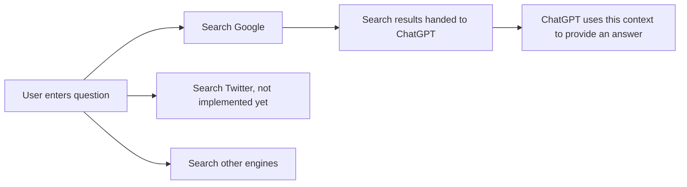

<div align="center">
	<br>
	<a href="https://github.com/tobiasbueschel/search-gpt/">
    
	</a>
	<h1>SearchGPT</h1>
	<p>
		<b>Connecting ChatGPT with the Internet</b>
	</p>
	<br>
	<br>
</div>

You want to try ChatGPT with Internet connectivity so that you can ask about events beyond 2021, but don't have access to AI-enabled Bing and don't want to wait for Google's Bard? SearchGPT gives you this functionality today - it crawls the Internet for information and then feeds it back to ChatGPT.


## Usage

The easiest way to get started with search-gpt is to run the following:

```sh
export OPENAI_API_KEY=<REPLACE>
export GOOGLE_SEARCH_API_KEY=<REPLACE>
export GOOGLE_SEARCH_ID=<REPLACE>

npx search-gpt
```

Alternatively, you can also run:

```sh
npm install --global search-gpt

# Run SearchGPT with this command
searchgpt
```

Ensure you have your own [Google Search API key](https://developers.google.com/custom-search/v1/introduction), [Programmable Search Engine](https://programmablesearchengine.google.com/controlpanel/all) and [OpenAI API key](https://platform.openai.com/) before running the CLI.

Once the CLI starts, it will prompt you to enter a question. Simply type in your query, and the AI assistant will search the web and generate a response.

## How it works

This is a proof of concept and is far from a proper implementation (e.g., Microsoft's [Prometheus Model](https://techcrunch.com/2023/02/07/openais-next-generation-ai-model-is-behind-microsofts-new-search)) - I wanted to experiment how easy it could be to crawl certain search engines and then feed these results into a large language model (LLM) such as GPT 3.5. Apart from querying Google Search, one could also think about integrating other APIs to crawl data and then feed it into the LLM.



## License

This project is licensed under the [MIT license](./license).
